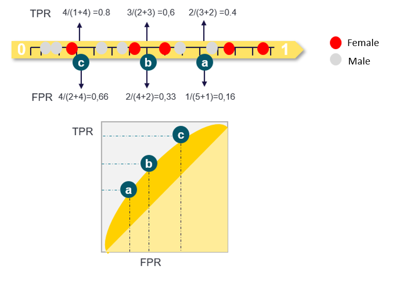

The idea of this workshop is to go through an application of GBM using an insurance dataset. We will fit and tune a Machine Learning model, check the performance and try to explain how the model works and why is making those predictions.

We will go through a quick overview of the data, them move into model fitting and tunning and at the end of the workshop we will are going to look at different strategies to understand our model predictions in a way to have a **global idea** of what is happening and look more deeply into **specific predictions** in a way we can explain 

Usually a very thorough evaluation of the data or data preparation is needed before all the modelling takes place, for the workshop we considered this out of scope. We believe that data preparation is a topic on his own **and a really important Topic**.

# Data: Health Insurance

But first let's look at the data.
The example that we will going to use its a kaggle data set that can be found here [Kaggle data](https://www.kaggle.com/annetxu/health-insurance-cost-prediction).

Its a small data set with the following features:

 - Age
 - Sex (male/female)
 - BMI (body mass index=$\frac{weight(kg)}{height^2}$)
 - Children (number of children)
 - Smoker (yes/no)
 - Region (southwest/southeast/northwest/northeast)
 - Charges (premium charges)

Let see how it looks in R:
```{r message=FALSE, warning=FALSE}
library(ggplot2)
library(tidyverse)
```
```{r}
dataset <- read.csv("./data/insurance.csv")
head(dataset,5)
```

We need to set the character variables as factors. This a common issue using R dataframes. If we specified that a column is a factor, generally speaking, the model will know how to effectively use this feature as a categorical variable.
```{r}
dataset$sex <- as.factor(dataset$sex )  #as factor
dataset$smoker <- as.factor(dataset$smoker) #as factor
dataset$region <- as.factor(dataset$region) #as factor
```

To investigate a bit further we can use the **skimr** package to do fast summary statistics analysis of our data.

```{r}
library(skimr)
dataset %>% skim()
```


*** 

---

# Model Building

There are many, many packages that implement ML models, usually they have a built in functionality to make predictions, fit and tune models. The problem is that the implementations for all these packages can be different and we could need to recode things because of the lack of consistency across packages.

It's better two use some packages that implement a whole framework for modelling using Machine Learning. One that I used a lot in the past and I think it's very  good for beginners is called **caret**:  **Classification and Regression Training** [link](https://topepo.github.io/caret/).

This package has functionality for **feature selection, feature engineering, model tuning and validation**. Using a simple and standard code we can fit different models very easily.

Let take our data for a run with **caret** and let's see if it's possible to predict the **gender** of the person based on the features of the data set.


To begin we load the **caret** package and (**very important**) set a seed to improve reproducibility.
```{r message=FALSE, warning=FALSE}
library(caret)
set.seed(3456) # very important to set a seed to improve reproducibility
```

## Data Splitting

We are going to split our data in **train** and **test set** but use a *stratified split* based on **gender**, this way we have the **same proportion of female/males on the test and training** data and this will help avoid potential bias of our performance metrics while evaluating the models.

```{r}
trainIndex <- createDataPartition(dataset$sex, p = .8, # 80% for training
                                  list = FALSE, 
                                  times = 1)

#split the data...
train.data <- dataset [trainIndex,]
test.data  <- dataset [-trainIndex,]
```

*** 

---

## (Optional): Calculate AUC

The ROC curve is designed calculating the TPR and FPR at different thresholds, after this we can calculate the area below these points.
In this example the red dots are the females (or positive cases) and the gray dot are the males (or negative cases). We have the points sorted by increasing estimated probability of being a female (from left to right).

{width=90%}


**The bigger the area below the curve better the overall trade off between Sensitivity and Specificity**.
 
### A simple explanation about AUC ROC

There are multiple ways to describe what this metric means, the best explanation for non-technical audience that I like is the following: **If we have a ROC auc of 0.9 and we take a random positive case and a random negative case. The model will predict a higher probability for the positive case 90% of the time.**


*** 

---

## Model Tuning

Machine Leaning models have parameters and **Hyper-parameters**, do you know the difference? Hint: Parameters are learned by the Machine Learning model using the data, and Hyper-parameters are usually selected by the modelers or tweaked in a way to estimate the parameters that optimize our model results.

There are many ways to search for the optimal Hyper-parameters of a model, in our case we will run as **exhaustive search**, namely: **Grid-Search**. 

  - See here a link to a interesting post about different strategies to search best hyper-parameters: [link](https://s3.amazonaws.com/assets.datacamp.com/production/course_6650/slides/chapter2.pdf)

We can create your custom grid and test as many Hyper-parameters as you want in the following manner:

 - Using the **expand.grid** will create all combination of the parameter we add here:
```{r}
#Search Grid
gbmGrid <- expand.grid(interaction.depth = c(3,5), #depth of our trees
                       n.trees = c(200,500,1000),  #number of trees or boosting iterations
                       shrinkage = c( 0.01,0.1),   #learning rate or how much to the models learn from each tree
                       n.minobsinnode = c(10,20))  #min observations needed to do splitting while building each individual tree
head(gbmGrid)
```

How many parameters are we trying ? Lets look at the dimension of the grid we just created.

```{r}
dim(gbmGrid)
```
We are going to try **24 different combinations of Hyper-parameters**

Here we use **caret trainControl** to prepare de model tuning with **k-fold cross validation** (more on this next) and repeat 3 times the estimation of performance estimates - **Repeated k-fold cross validation**


```{r}
#------------------- Prep Modeling ------------------
trcontrol = trainControl(method = "repeatedcv", #type of cross-validation
                         number = 5, # k.fold
                         repeats = 3, # repeats
                         allowParallel = TRUE,
                         verboseIter = FALSE,
                         summaryFunction=twoClassSummary, #use specfic statistic for two class: namely AUC 
                         classProbs=T, #save the probabilities
                         search = "grid")

```


*** 

---

## What is **k-fold Cross Validation**

This technique is common on ML models, specially especially if we have a **reasonable amount  of data or big computer power** because it can take some time to get the final results.

Here is how it works

  1) Shuffle the dataset
  2) Split the dataset into k groups of similar size
    For each group:
      i)   Take the group as a hold out or test data
      ii)  Take the remaining groups as a training data 
      iii) Fit a model on the training data and evaluate it on the test data
    Retain the evaluation score and discard the model
  3) Summarize the performance of the model using model evaluation using the mean or median os all folds


[www.kaggle.com](https://www.kaggle.com/discussion/204878) 

*** 

---

## Train the model

We have our **tunning setup** created (repeated-cross validation) and our **grid of parameters** that we want to try, now we need to train/fit our model and **find the best hyper-parameters that maximize the performance**, in this case measured by **ROC-AUC**.

We just call the **train function** using as parameters all the artifacts created above and wait for the results.

```{r echo=TRUE}
set.seed(825)
gbmFit <- train(x = train.data %>% select(-sex), #we are predicting sex so we need to remove from the data
                y = train.data$sex,
                method = "gbm",
                trControl = trcontrol, # the repeated k-fold strategy
                verbose = FALSE,
                tuneGrid = gbmGrid, #our grid
                ## Specify which metric to optimize
                metric = "ROC")
gbmFit
```

Visualizations of the tuning provided by the caret package.

```{r}
plot(gbmFit)
```

**Can You Spot the best hyper-parameters?**

This last object **gbmFit** obtained by the **train function** has the best hyper-parameters found while tuning the model but also a trained a final model on all the data with the selected best hyper-parameters.

And the best Hyper-parameters are:
```{r}
gbmFit$bestTune

```

To get the prediction we call the **predict** function using the **gbmFit** on the test data.

```{r}
prediction<- predict(gbmFit,test.data,type="prob") # type="prob" for returning probabilities
prediction$obs<-test.data$sex
head(prediction,5)
```


*** 

---


# Model Evaluation

This is a crucial part of our modelling, we need to evaluate carefully our model on data that the model didn't "saw" before to avoid potential bias on the analysis. Also we need to understand how do our model behave so we can validate our expectations and find potential issues with the predictions. In the next part of our analysis we will always use **test data**. This data was stored above when we did the **data splitting**.

A very interesting package for evaluating models it's the named **yardstick**, let's load the package and look at the results.
```{r}
library(yardstick)
#Store the prediction from gbm
test.data_gbm <- test.data 
test.data_gbm$prediction <- prediction$female #Store the prediction for being female
test.data_gbm$target <- prediction$obs #Store the observed values female/male
test.data_gbm$mode <- "gbm"
```

Calculate **ROC-AUC** on our test data.
```{r}
# ROC AUC Estimates
roc_auc(test.data_gbm , target, prediction)
```

## ROC-AUC curve

An plotting the ROC-AUC curve.

```{r}
# Auc Plot
test.data_gbm %>% 
roc_curve(target, prediction) %>%
  ggplot(aes(x = 1 - specificity, y = sensitivity,color='red')) +
  coord_equal() + # plot with 2 ROC curves for each model
  geom_line(size = 1.1) +
  geom_abline(slope = 1, intercept = 0, size = 0.4) 
```

*** 

---


## Calibration Plot

This a very simple plot that will allow us to see if the probabilities are well **calibrated**, meaning that **if we select ALLL the policies with the probability of being female less than 20%** then in that group it should be **around 20% of females**.

```{r}
calPlotData <- calibration(target ~ prediction , data = test.data_gbm,cuts = 12)
calPlotData
```

Next: plotting the so called **calibration plot**.

```{r}

plot(calPlotData, type = "b", auto.key = list(columns = 2,
                                          lines = TRUE,
                                          points = TRUE))

```

*** 

---

# Model Understanding and Explanation

A growing field on ML is model **Explainability** or **Interpretability**. The intent is to create tools that allow us to look into the black-box model and try to understand the way that predictions are made. This way we can also identify potential issues or bias on our ML models. 
A interesting package in R that we will use next is DALEX [link](https://github.com/ModelOriented/DALEX). This package has multiple functionalities for model interpretation, we will only look at some of this here.

Lets load the package.
```{r}
library(DALEX)
library(ingredients) #this package is needed for some plotting
```

In here we have just a helper function to adapt the predicted probabilities returned by the model into the shape that DALEX functions expects it to be:

```{r}
#"Help function for ML predictions"
custom_predict <- function(object, newdata) {
  pred <- predict(object, newdata = newdata, type = "prob")
  response <- (pred$female)
  return(response) #returns only the predited value, nothing more
}
```

Using the Dalex we need to create a **Explainer** of our model using the test data, this **explainer** encodes the relations between the explanatory variables and the patterns learned by the model.
This same explainer will help us to look into different characteristics of our model.
```{r}
#predict(gbmFit,test.data,type="prob" )

explainer_gbm <- DALEX::explain(
  gbmFit, #the trained model
  label = "gbm_model",
  data = test.data_gbm %>% select(-target,-sex,-prediction,-mode), # test data with only the model variables
  #y =test.data_gbm$target,
  y =if_else(test.data_gbm$target=="female",TRUE,FALSE), # the observed values
  predict_function = custom_predict
)
```


## Variable Importance

Let's look at the most important variables used our model make predictions. For this we will use **variable importance** estimates, this is a model agnostic technique that can be adapted to most ML models and that will helps us understand how relevant are the features to make predictions.

```{r}
# Variable Importance -----------------------
vi_classif_gbm <- variable_importance(explainer_gbm)
plot(vi_classif_gbm)
```

It looks like the **charges and age seem to be the most important features** to predict if a subject its a female.


## Partial Dependence Plots

The following technique, also model agnostic, is called **Partial Dependence Plots**. It tries to show the marginal effects of each variable on the model predictions: if the value of the variable change how does the prediction value changes? Does it go up or down?
```{r}

#Compute PDP for a numercial variables ------------
pdp_glm <- partial_dependence(explainer_gbm,
                              N = 100, variable_type = "numerical")
#head(pdp_glm)
plot(pdp_glm)
```

The same analysis but for categorical features.

```{r}
#Compute PDP for a categorical Categorical -------------
pdp_glm <- partial_dependence(explainer_gbm,
                              N = 100, variable_type = "categorical")
#head(pdp_glm)
plot(pdp_glm)
```

*** 

---

## Explain a Single Prediction


We can go in to very detail about the predictions, the current *state of the art* for model explainability allow us to discuss how the model predicts a specific case. We will use the **Breakdown** algorithm that we you can see explained in detail in the following link [link](https://arxiv.org/abs/1804.01955) 

We select a single insured person with this specific information:
```{r}
# Create an explainer object
single_observation = test.data[15,] # this is specific observation from our data set..randomly
single_observation
```

Now we will use the explainer created above and use this information to explain this single prediction using **Breakdown** .

```{r}
# Using the Dalex Package ------------
bd_lm <- predict_parts_break_down(explainer_gbm, new_observation = single_observation,type = "break_down")
#head(bd_lm)
plot(bd_lm)
#prediction using brekdown strategy
```

The idea behind this plot is: having a base value of average probability that is common for clients with similar profiles, how do the predictions change as we add explanatory variables to our model in a given sequence. The plot shows the impact of features, increasing or decreasing the expected probability. In this case de average probability of being female was 0.45 and the final prediction was 0.14, the biggest reasons was the relatively high age, being smoker and a high premium/charges.


*** 

---


